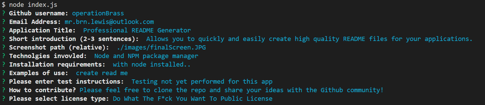
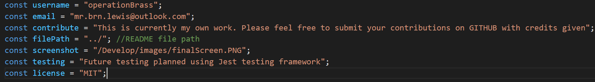

# Pro README Generator


  [](https://opensource.org/licenses/MIT)


  


          
### Description 

This app will allow you to quickly create professional quality README files. Save your repeat information as default inputs! 


### Table of Contents

* [Usage Guide](#Usage-Guide)
* [Install Instructions](#Installation)
* [Technologies Used](#Technologies-Used)
* [Contributions](#Contributions)
* [Tests](#Tests)
* [Questions](#Questions)


## Usage Guide 

Creating MARKDOWN READMES for GITHUB or other open source repositories. For super fast READMEs, be sure to update these variables in index.js with your own repeat information!

  

  Check out the video instructional [here](https://drive.google.com/file/d/1BgKupDVuy_WDEVAYnXvEtBUuzUrPvgvF/view)


## Installation 

With Node installed, open a new BASH terminal in the directory of the app and run NPM Install

 ```NPM Install```

Then just run the Index.JS file to begin the README creation 

```Node Index.js```


## Technologies Used 

Node and NPM


## Contributions 

This is currently my own work. Please feel free to submit your contributions on GITHUB with credits given

## Tests 

Future testing planned using Jest testing framework

## Questions 

If you have any questions or want to keep up with my latest projects, please follow me on [Github](http://www.github.com/operationBrass) or contact me via [Email](mr.brn.lewis@outlook.com). 
